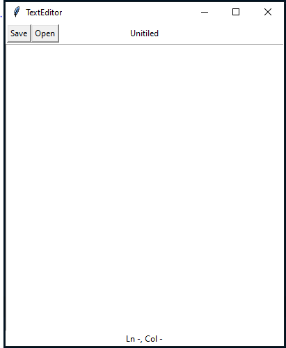

# Text Editor
A simple GUI text editor made with python tkinter module

## Running
### Make sure to get python 3.9 or above
This runtime is required to run the code
### Run the main file

## Preview

